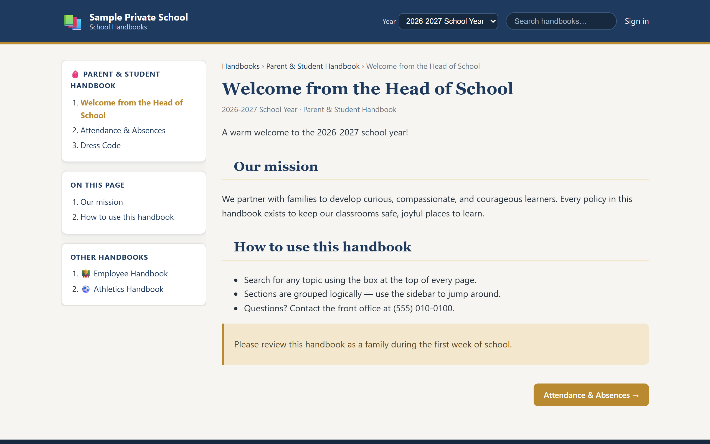
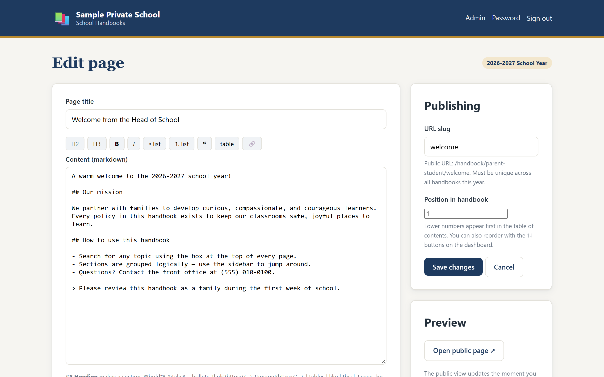
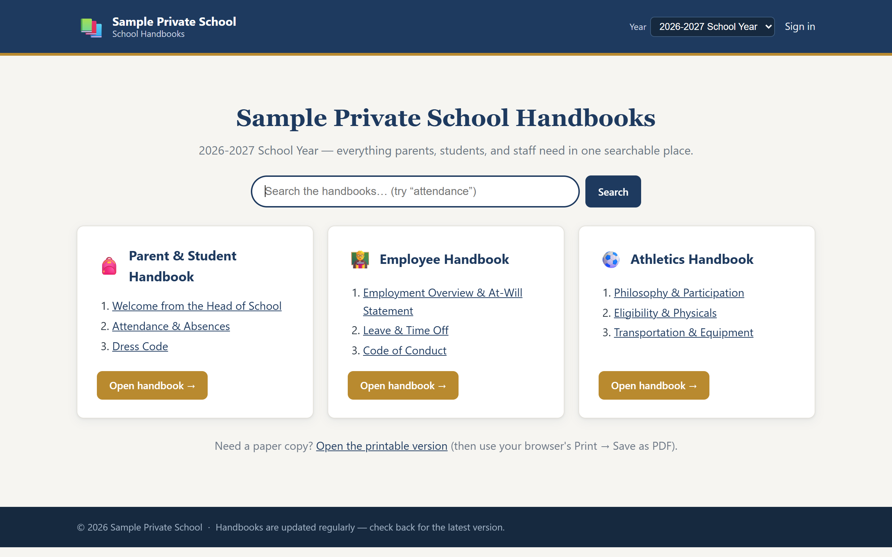
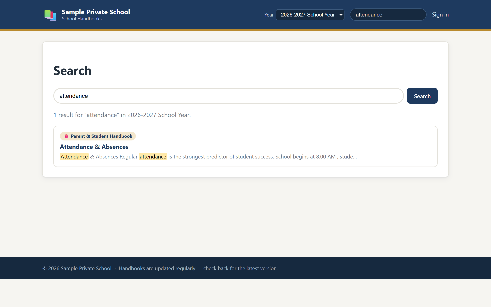

# School Handbooks 📚

  

Self-hosted handbook publishing for schools — three handbooks (**Parent & Student**,
**Employee**, **Athletics**), markdown editing for staff, and a clean, searchable,
read-only site for parents. Run it on a $5 server. Own it outright. No subscriptions.

Built for a private K-12 school that was frustrated with expensive handbook SaaS
(HTML-in-a-textbox editing, no collaboration) and Google Docs (no real TOC, weak
formatting, poor search). This is the middle ground: content lives in **plain markdown
files**, editing happens in a friendly web editor, and parents get a proper
documentation site with a live clickable table of contents and full-text search.

| Reading (what parents see) | Editing (what staff see) |
| --- | --- |
|  |  |

| Home | Search |
| --- | --- |
|  |  |

## Why this instead of a SaaS

- **Collaborative enough** — every principal/admin gets a staff account; edits are
  made in the browser with a toolbar, not raw HTML.
- **A real TOC, not a workaround** — sidebar navigation per handbook, plus an
  "on this page" outline with anchored headings on every page.
- **Real search** — full-text across all handbooks, prefix matching ("attend" finds
  "attendance"), title boosting, highlighted excerpts.
- **Per-school-year versioning** — duplicate this year into next in one click, edit
  the draft all summer, publish in August. Old years stay browsable.
- **You own it** — no database, no vendor, no per-editor pricing. Every page is a
  markdown file under `data/`; back it up by copying the folder.

## Quick start

Requires Node.js 18+.

```bash
npm install
npm run seed        # creates the admin user + 9 sample pages (first run only)
npm start           # → http://localhost:4321
```

The seed prints a generated password for the `admin` user (set `ADMIN_PASSWORD`
before first run to choose your own). A sample `editor` account is also created —
change or remove both before real use.

## The yearly workflow

1. **Spring:** click **Duplicate → 2027-2028**. Every page is copied as an
   unpublished draft.
2. **Summer:** edit the draft — dates, policies, new sections. Parents keep seeing
   last year's published version.
3. **August:** click **Publish**. The new year goes live; the old year remains
   browsable via the year switcher in the header.

## Printing and archiving

- `/print/<year>` — the whole year on one page with print styling; browser
  **Print → Save as PDF** gives you the official archive.
- `/export/<year>` — the same thing as a single portable HTML file, for emailing
  or dropping into a website archive.
- Any individual page prints cleanly on its own (navigation is stripped).

## Configuration

| Variable | Default | Purpose |
| --- | --- | --- |
| `PORT` | `4321` | HTTP port |
| `HOST` | `0.0.0.0` | Bind address |
| `DATA_DIR` | `./data` | Where all content and accounts live |
| `SESSION_SECRET` | random per start | **Set in production** so logins survive restarts |
| `SESSION_MAX_AGE_HOURS` | `12` | Staff session lifetime |
| `ADMIN_PASSWORD` | random, printed once | Password for the seeded `admin` (first run only) |
| `SCHOOL_NAME` / `SITE_NAME` | sample values | Header/footer branding |
| `NODE_ENV` | — | `production` enables the secure session cookie |

## How content is stored

```
data/
  users/users.json                      # staff accounts (bcrypt hashes)
  years/
    2026-2027/
      settings.json                     # title, published, archived
      handbooks/
        parent-student/0001-<id>.md     # one markdown file per page
        employee/0002-<id>.md
        athletics/0001-<id>.md
```

Each page is markdown with a two-line front-matter block (title, slug). The slug is
unique within a year and drives the public URL (`/handbook/athletics/eligibility`), so
links stay stable. Ordering is a numeric filename prefix — managed by the dashboard's
↑↓ buttons.

**Backing up is copying `data/`.** Restoring is copying it back. Diffs, sync, and
git all work naturally.

## Deployment

**Docker:**

```bash
SESSION_SECRET=some-long-random-string docker compose up -d --build
```

Content persists in the `handbook-data` volume. Put nginx/Caddy (or any TLS proxy)
in front for HTTPS — the app also sends a strict Content-Security-Policy,
`X-Content-Type-Options`, and `Referrer-Policy` on every response.

**Bare Node:**

```bash
npm ci --omit=dev
NODE_ENV=production SESSION_SECRET=... PORT=80 node src/server.js
```

## Documentation

**The complete staff guide — editing, the year workflow, accounts, printing,
troubleshooting — lives in [docs/USAGE.md](docs/USAGE.md).**

## Development

```bash
npm test                  # 13 integration tests (public, admin, search, years)
npm run audit:responsive  # layout audit at 6 device widths (needs local Chrome/Edge)
npm run dev               # restart on file changes
```

Tests use a throwaway data directory and never touch `./data`. The responsive audit
drives headless Chrome via puppeteer-core, checks every key page (public and admin)
from 360px phones to 1280px desktops for horizontal overflow and layout bugs, and
exits non-zero if anything is wrong — ready to gate CI.

## Project layout

```
config.js              env-driven settings
seed.js                idempotent first-run seeding
src/server.js          express app + middleware (security headers, sessions)
src/content.js         markdown content store, year management, HTML export
src/search.js          in-memory inverted-index search
src/users.js           user store, bcrypt auth
src/middleware.js      auth guards + CSRF
src/routes/            public, auth, admin routers
views/                 EJS templates (public site + admin)
public/                css + small client scripts (editor toolbar, flash, year switcher)
scripts/               responsive layout audit
test/app.test.js       integration suite
docs/USAGE.md          complete staff documentation
```

## Security notes

- Passwords are bcrypt-hashed; sessions are httpOnly SameSite cookies; every form
  carries a CSRF token.
- Draft years are hidden from public navigation but not password-protected at their
  URL — don't stage confidential material in a draft on a public deployment.
- Runs behind any reverse proxy; terminate TLS there (no HSTS is sent by the app
  itself, so add it at the proxy).

## License

[MIT](LICENSE) — use it, fork it, run your school on it.
